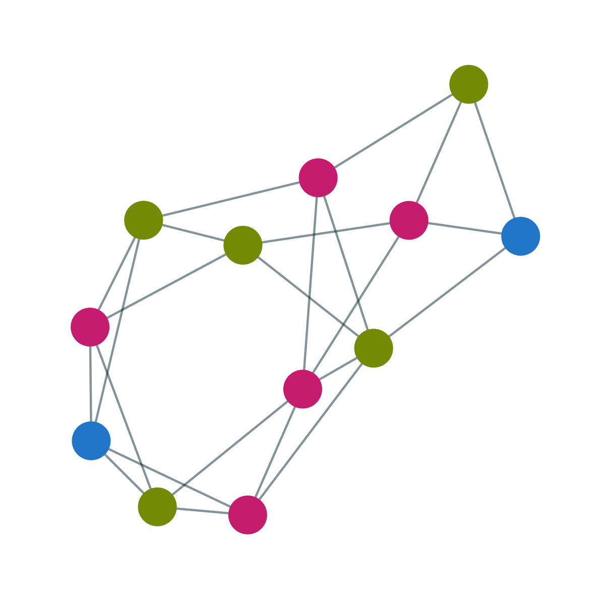

Aside
================================================================================

{width=80%}

Contact {#contact}
--------------------------------------------------------------------------------

- <i class="fa fa-envelope"></i> cgilroy@uw.edu
- <i class="fa fa-globe"></i> [students.washington.edu/cgilroy](https://students.washington.edu/cgilroy)
- <i class="fa fa-github"></i> [github.com/ccgilroy](https://github.com/ccgilroy)
- <i class="fa fa-twitter"></i> [\@ccgilroy](https://twitter.com/ccgilroy)
- <i class="fa fa-phone"></i> 731-225-0001

Skills {#skills}
--------------------------------------------------------------------------------

**Programming:** R, Python, Stan, SQL

**Data science:** Statistical modeling and data visualization of survey, network, spatial, and text data. Combining disparate data sources, including from web-scraping, APIs, and Hive tables.

**Language:** English (native), Spanish (advanced), Japanese (advanced), French (intermediate)

<!-- Workshops 
--------------------------------------------------------------------------------

**CSS workshops organized:**  

- [SICSS-Seattle](https://compsocialscience.github.io/summer-institute/2018/seattle/) (2018)  
- [IUSSP training workshop on digital demography](https://github.com/CSDE-UW/IUSSP-digital-demog-2017) (Cape Town, 2017)  
- [Computational Demography Working Group](https://csde-uw.github.io/computational-demography/) (UW, 2018-2020)  
-->

Disclaimer {#disclaimer}
--------------------------------------------------------------------------------

This resume was made with the R package [**pagedown**](https://github.com/rstudio/pagedown).

Last updated on `r Sys.Date()`.

Main
================================================================================

Connor Gilroy {#title}
--------------------------------------------------------------------------------

### Computational sociologist & PhD student

Education {data-icon=graduation-cap data-concise=true}
--------------------------------------------------------------------------------

### PhD, Sociology 

University of Washington

Seattle, WA

expected 2022 - 2018

Comprehensive Exam: "Community: Origins, Processes, and Consequences." Passed with distinction (June 2019) 

Certificate: Special Concentration in Social Statistics (May 2019)

### MA, Sociology

University of Washington

Seattle, WA

2018 - 2015

Thesis: "How Distinct is Gay Neighborhood Change? Patterns and Variation in Gayborhood Trajectories." 

- Department of Sociology Outstanding Master's Thesis (2019)
- Graduate School Distinguished Thesis Award in Social Sciences (2019)

Committee: Kate Stovel (chair), Emilio Zagheni

### BA, Biology and Geophysical Sciences

University of Chicago 

Chicago, IL

2013 - 2009

Minor: Gender and Sexuality Studies

Publications {data-icon=book}
--------------------------------------------------------------------------------

### Measuring the Predictability of Life Outcomes with a Scientific Mass Collaboration

N/A

N/A

2020

Salganik, Matthew J., Ian Lundberg, Alexander T. Kindel, [and 109 others, including **Connor Gilroy**]. *Proceedings of the National Academy of Sciences* 117(15):8398–8403.

### Humans in the Loop: Incorporating Expert and Crowdsourced Knowledge for Predictions using Social Survey Data 

N/A

N/A

2019

Anna Filippova, **Connor Gilroy**, Ridhi Kashyap, Antje Kirchner, Allison C. Morgan, Kivan Polimis, Adaner Usmani, and Tong Wang. *Socius.* https://doi.org/10.1177/2378023118820157. (corresponding author)

Work in Progress {data-icon=book-open}
--------------------------------------------------------------------------------

### How Distinct is Gay Neighborhood Change? Patterns and Variation in Gayborhood Trajectories

N/A

N/A

N/A

### Digital Traces of Sexualities: How Patterns of Social Media Disclosure Can Extend the Demography of Sexuality

N/A

N/A

N/A

With Ridhi Kashyap.

### Social Structure and Change in Public Opinion: The Case of Same-Sex Marriage

N/A

N/A

N/A

With Katherine Stovel. Invited book chapter for *Architecture of the Social*, Peter Hedström and Petri Ylikoski, editors. *draft submitted September 2016*

::: aside

Fellowships, Honors, & Awards {#awards}
--------------------------------------------------------------------------------

**2019.** Graduate School Distinguished Thesis Award in Social Sciences

**2019.** Department of Sociology Outstanding Master's Thesis  

**2018.** Travel Award, Schwartz Endowment, University of Washington ($1000)

**2017.** Best Poster (for "Extending the Demography of Sexuality with Digital Trace Data") (co-winner), Fall Lightning Talks and Poster Session, Center for Studies in Demography and Ecology, University of Washington

**2017.** Travel Award, Graduate School Fund for Excellence and Innovation, University of Washington ($500)

**2017.** Participant in the Russell Sage Foundation Summer Institute in Computational Social Science (SICSS), Princeton University

**2016--2017.** NIH Big Data to Knowledge (BD2K) Fellowship, Center for Studies in Demography and Ecology, University of Washington ($23376)

**2016.** Schwartz Award, Department of Sociology, University of Washington ($3500)

**2015--2016.** Top Scholar Award, Graduate School Fund for Excellence and Innovation, University of Washington

:::

Research Experience {data-icon=laptop}
--------------------------------------------------------------------------------

### Graduate Research Assistant

University of Washington 

Seattle, WA

present - 2020

- Text and network community detection (with Zack Almquist)  | **Python, R**

### User Experience Research Intern

Facebook

Seattle, WA

2020

- Quantitative studies of participation in new communities | **R, SQL**

### Consultant, Survey Data Analysis

The World Bank Group

Washington, DC

2020

- Modeling and visualization of gender-based disparities in Central Asia | **R**

### Graduate Research Assistant

University of Washington 

Seattle, WA

2017 - 2015

- Agent-based network models (with Katherine Stovel) | **NetLogo, R**

Teaching Experience {data-icon=chalkboard}
--------------------------------------------------------------------------------

### Instructor

University of Washington 

Seattle, WA

N/A

- SOC 225: Data and Society (2018, 2019)

### Graduate Teaching Assistant

University of Washington 

Seattle, WA

N/A

**Undergraduate:** 

- SOC 316: Sociological Theory (2019)
- SOC 225: Data and Society (2018)
- SOC 401 A: Data Science and Population Processes (2017)
- SOC 351: Intimate Relationships (2016)

**Graduate:** 

- SOC 504, 505, 506: Social Statistics (2019-2020)
- CSSS 564: Bayesian Statistics for the Social Sciences (2018, 2019)

### Workshops

N/A

N/A

N/A

- **Organizer**, Seattle partner location for the Summer Institute in Computational Social Science ([SICSS-Seattle](https://compsocialscience.github.io/summer-institute/2018/seattle/}{SICSS-Seattle)). eScience Institute, University of Washington (2018)
- **Facilitator**, [IUSSP Training workshop](https://github.com/CSDE-UW/IUSSP-digital-demog-2017) on Social Media, Big Data and Digital Demography. Side meeting at the International Population Conference, Cape Town (2017)

Other Work Experience {data-icon=desktop}
--------------------------------------------------------------------------------

### Quality Assurance

Epic Systems Corporation 

Verona, WI

2015 - 2013

- Automated and manual software testing | **C#, Python, Excel**

::: aside

Service {#service}
--------------------------------------------------------------------------------

Reviews for *Socius*, *Demographic Research*, *CHI*, *Journal of Homosexuality*

**2020--present.** Secretary, Graduate Student Association, Department of Sociology, University of Washington

**2018--2020.** Organizer, Computational Demography Working Group, Center for Studies in Demography and Ecology, University of Washington

**2018.** Influencer, Social Media Team, ASA Sexualities Preconference

**2016--2017.** Officer, Rainbow Grads, University of Washington

**2015--2017.** Wiki Coordinator, Graduate Student Association, Department of Sociology, University of Washington

:::

Conference Presentations {data-icon=comments}
--------------------------------------------------------------------------------

### Digital Traces of Sexualities: How Patterns of Social Media Disclosure Can Extend the Demography of Sexuality

Annual Meeting of the American Sociological Association

New York, NY

2019

Regular session, "Sexualities I: Measuring Continuity and Change in Sexualities"

### How Distinct is Gay Neighborhood Change? Patterns and Variation in Gayborhood Trajectories

Annual Meeting of the American  Sociological Association

Philadelphia, PA

2018

Special session on "The Social and Cultural Construction of Places"

### Power in the Pipeline? Queer Accountability and the Ethics of Data Processing

ASA Sexualities Section Preconference

Philadelphia, PA

2018

"Methodologically Queer" panel

### Extending the Demography of Sexuality with Digital Trace Data

Population Association of America Annual Meeting

Denver, CO

2018

Session on Families, Social Media, and Technology

### Social Movement Framing in the Media: The Case of Recent Anti-LGBT Legislation in the United States

Annual Meeting of the American  Sociological Association

Montréal, QC, Canada

2017

Sociology of Sexualities Roundtable Session
